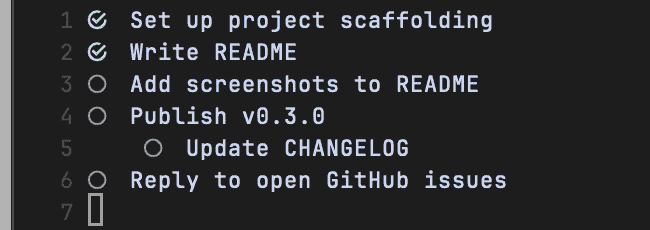
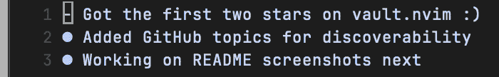
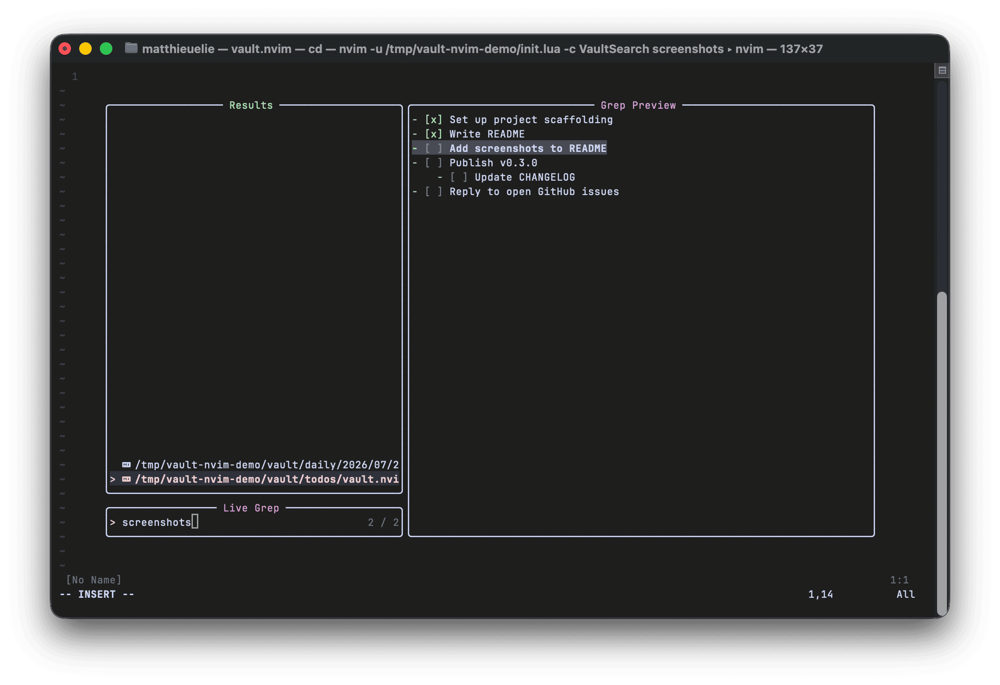

# vault.nvim

A lightweight, project-specific task manager and diary plugin for Neovim.

## Features

- Toggle project-specific Markdown TODO list.
- Quickly append a todo to the current project's `todos.md` via a prompt, without opening the buffer.
- Archive checked todos out of `todos.md` into a per-project `archive.md`, grouped by day.
- Open today's diary note (`daily/YYYY/MM/DD-MM-YYYY.md`).
- Navigate to the previous/next diary day, or jump to an arbitrary date via a prompt.
- Search the whole vault, or scope to just todos or diary notes, using Telescope if installed, falling back to the quickfix list otherwise.
- Automatically handles directory creation based on git root or active project root.
- Simple, indentation-aware checkbox toggler.

## Screenshots

Project todos, checked off with `VaultToggleCheckbox` and rendered with
[render-markdown.nvim](https://github.com/MeanderingProgrammer/render-markdown.nvim):



Today's diary note, opened with `VaultToggleDiary`:



`VaultSearch` scoped to the vault, using Telescope's live grep:



## Requirements

Neovim >= 0.8 (the plugin relies on the `vim.fs` module — `vim.fs.find`,
`vim.fs.dirname`, `vim.fs.normalize` — added in that release).

## Installation

Using [lazy.nvim](https://github.com/folke/lazy.nvim) — add this spec to the list passed to `require('lazy').setup({...})`:

```lua
{
    'MatthieuELIE/vault.nvim',
    keys = {
        { '<leader>vt', '<cmd>VaultToggleTodo<CR>', desc = 'Toggle Vault Todo' },
        { '<leader>vi', '<cmd>VaultQuickAddTodo<CR>', desc = 'Quick Add Vault Todo' },
        { '<leader>vd', '<cmd>VaultToggleDiary<CR>', desc = 'Toggle Vault Diary' },
        { '<leader>vn', '<cmd>VaultDiaryNext<CR>', desc = 'Next Vault Diary Day' },
        { '<leader>vp', '<cmd>VaultDiaryPrev<CR>', desc = 'Previous Vault Diary Day' },
        { '<leader>vg', '<cmd>VaultDiaryGoto<CR>', desc = 'Go to Vault Diary Date' },
        { '<leader>vs', '<cmd>VaultSearch<CR>', desc = 'Search Vault' },
    },
    opts = {}
}
```

`VaultToggleCheckbox`/`VaultArchiveTodos` aren't listed above: they're bound
automatically inside `todos.md` buffers, see `keys` below.

Using [vim.pack](https://neovim.io/doc/user/pack.html) (built into Neovim >= 0.12, no plugin manager needed) — drop this straight into `init.lua`:

```lua
vim.pack.add({ 'https://github.com/MatthieuELIE/vault.nvim' })
require('vault').setup({})
```

Using [packer.nvim](https://github.com/wbthomason/packer.nvim) — add this inside `require('packer').startup(function(use) ... end)`:

```lua
use({
    'MatthieuELIE/vault.nvim',
    config = function()
        require('vault').setup({})
    end,
})
```

## Configuration

You can customize the base path of your vault by setting the `VAULT_PATH` environment variable. By default, it uses `~/vault`.

```lua
opts = {
    vault_path  = '~/vault',        -- or set $VAULT_PATH
    todos_path  = '~/vault/todos',  -- default: vault_path
    daily_path  = '~/vault/daily',  -- default: vault_path/daily
    date_format = '%d-%m-%Y',       -- diary note filename format (os.date tokens)
    split       = 'vsplit',         -- 'split' for horizontal, 'edit' to reuse the current window

    -- Optional: seed newly created notes from template files. Templates are only
    -- applied to a note the first time it's created, never to an existing file.
    templates_path = '~/vault/Templates',
    templates = {
        todos = 'Todo Template.md',        -- these are the defaults; override either
        daily = 'Daily Note Template.md',  -- one only if your filenames differ
    },

    -- Global keymaps are opt-in: omit `keys` entirely and vault.nvim won't
    -- touch your keymaps, only the `:Vault*` commands are available.
    -- `keys = true` enables the defaults below as-is; pass a table instead
    -- to override individual entries (the rest still fall back to their
    -- default). `toggle_checkbox`/`archive_todos` are buffer-local (only
    -- active inside vault todos.md buffers) and stay on regardless of
    -- `keys`, but can still be remapped/disabled through this same table.
    keys = true, -- or e.g. { toggle_todo = '<leader>x', search = false }

    -- keys = {
    --     toggle_todo     = '<leader>vt',
    --     quick_add_todo  = '<leader>vi',
    --     toggle_checkbox = '<leader>vc',
    --     archive_todos   = '<leader>va',
    --     toggle_diary    = '<leader>vd',
    --     diary_next      = '<leader>vn',
    --     diary_prev      = '<leader>vp',
    --     diary_goto      = '<leader>vg',
    --     search          = '<leader>vs',
    -- },
}
```

## Contributing

See [ARCHITECTURE.md](ARCHITECTURE.md) for how the code is
organized, and [CONTRIBUTING.md](CONTRIBUTING.md) for running
tests, lint, and formatting.
